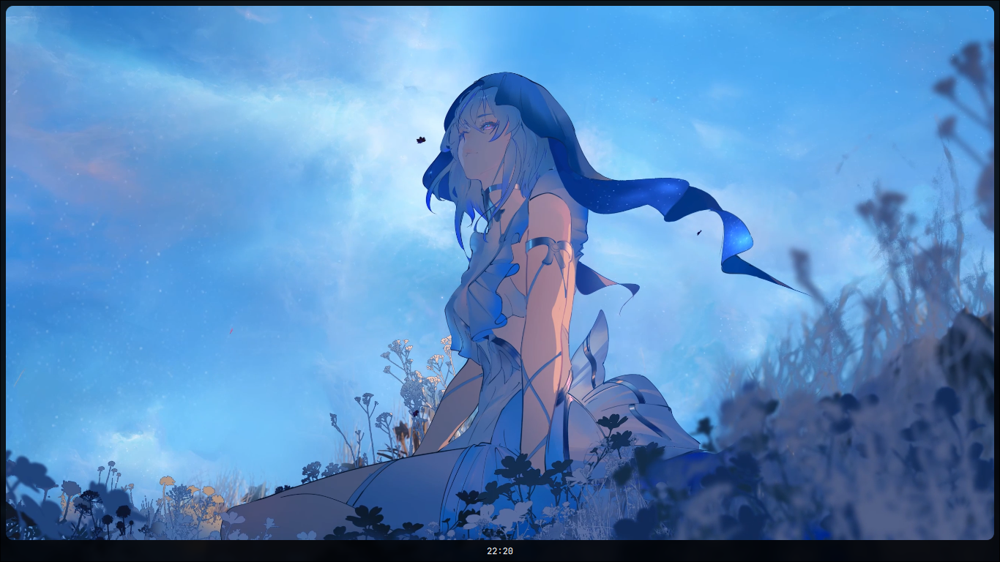

<samp> so far </samp>

#### tasks (todo)
- [x] finish the simple bar
- [ ] create a osd for brightness and volume changes
- [ ] add settings menu with quick controls
- [ ] add a simple calendar widget to the time 
- [ ] create a simple application launcher to replace rofi
- [ ] make a lockscreen
- [ ] make a wallpaper selector
- [ ] create a notification manager
