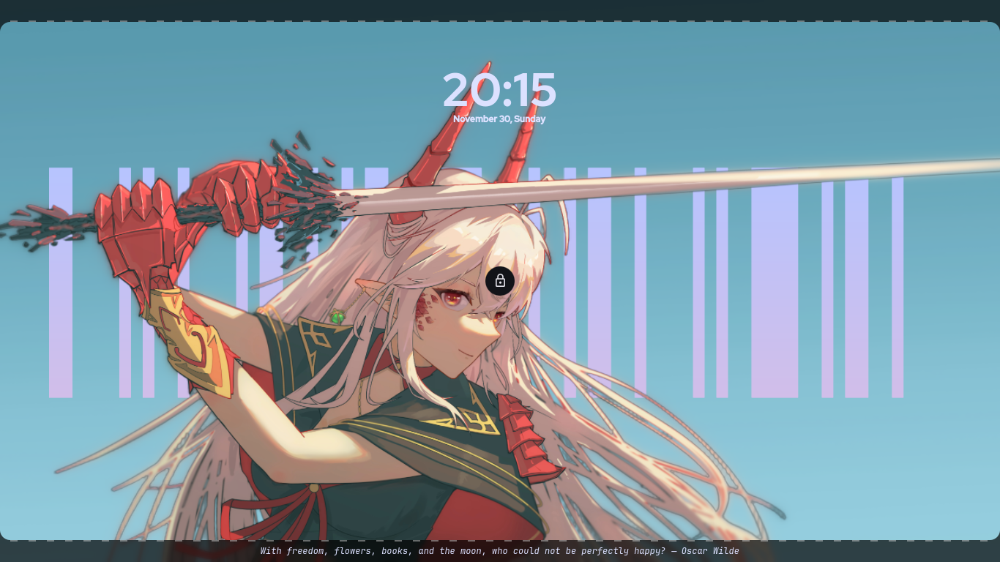
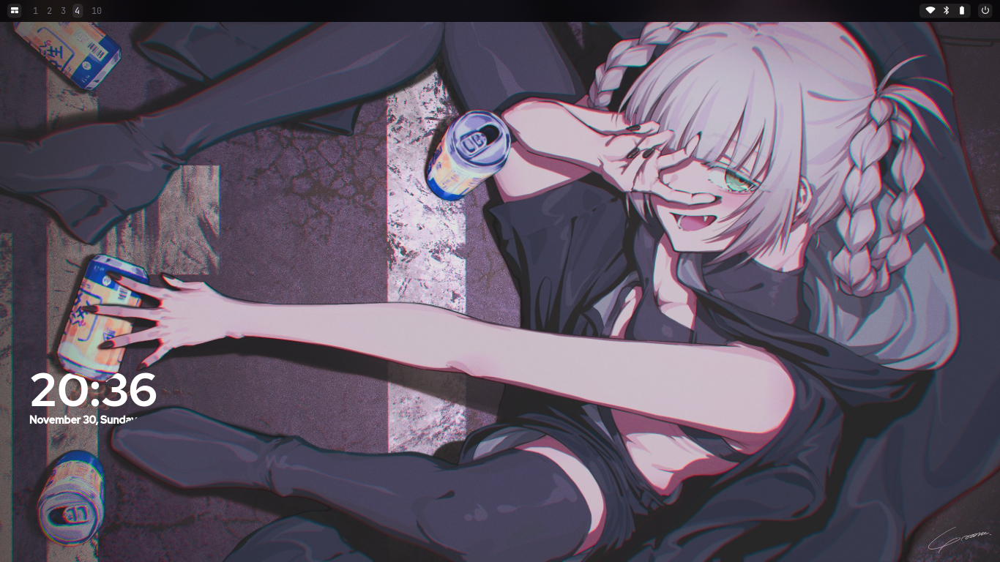

## Quickshell

| Lockscreen | Desktop |
|:---|:---|
|  |  |

## Credits

- [kurukurubar](https://github.com/Rexcrazy804/Zaphkiel/tree/master/dots/quickshell/kurukurubar) - Barcode thingy in lockscreen
